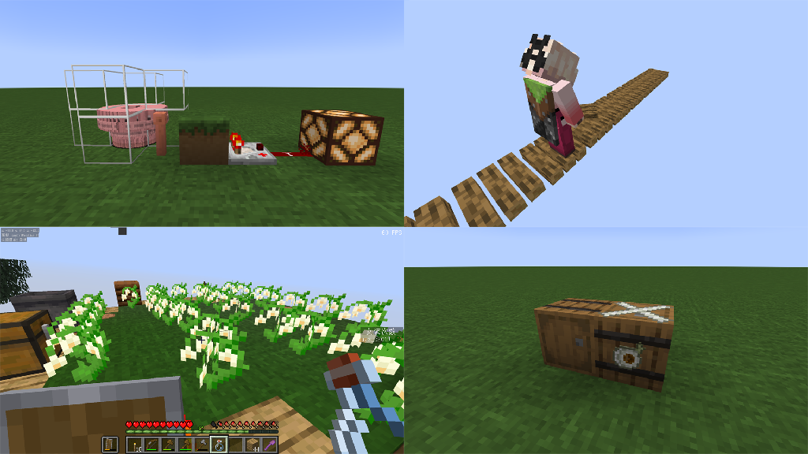
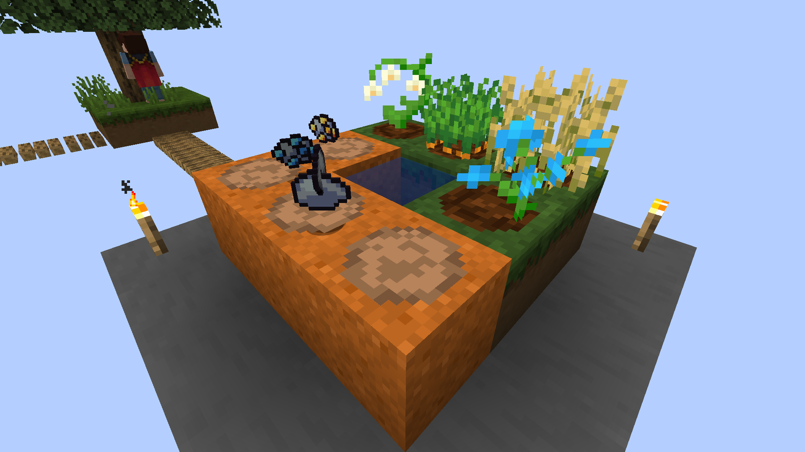
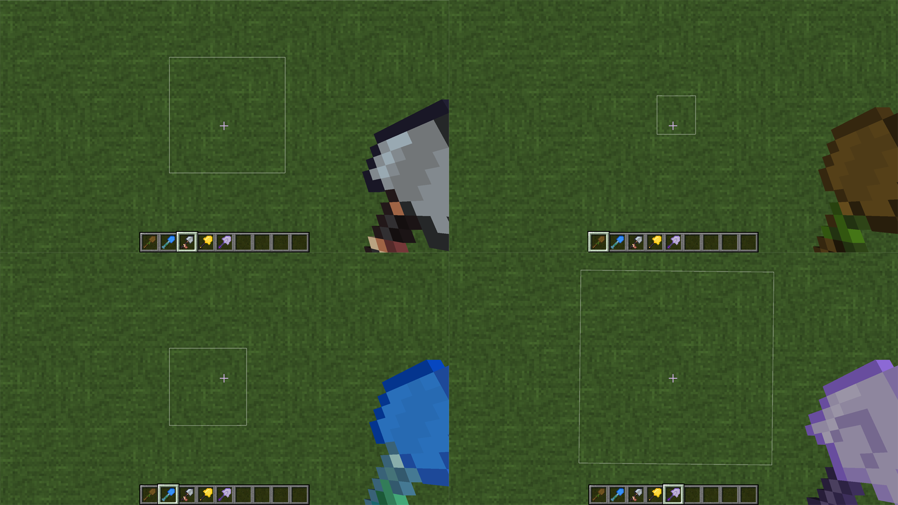
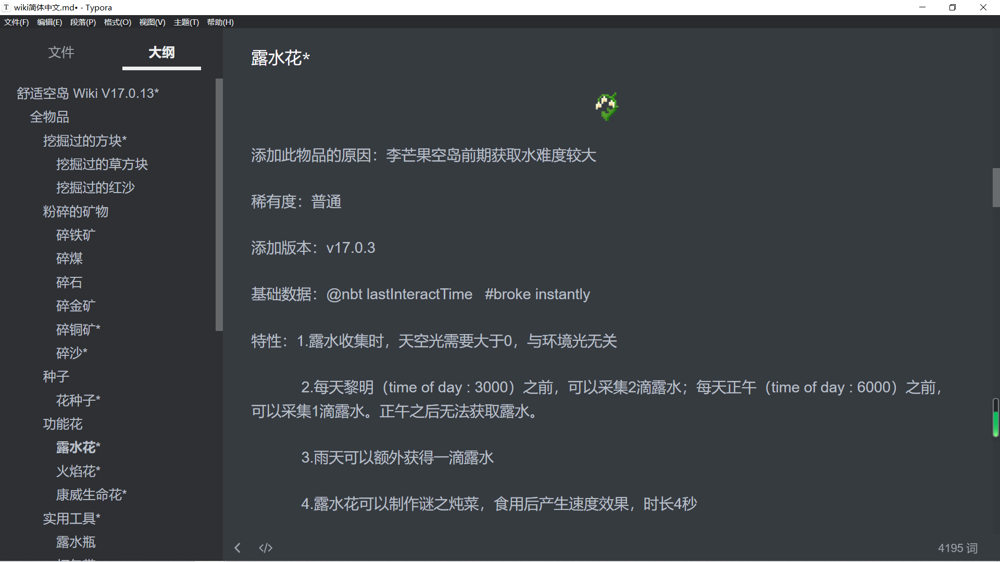
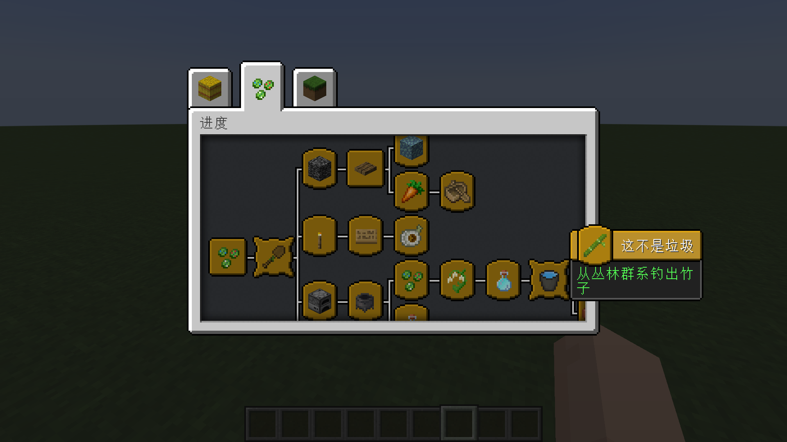
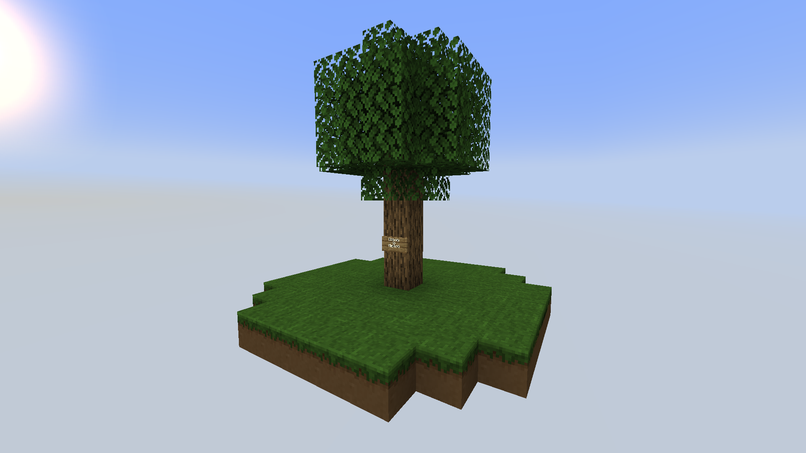

## 欢迎来到舒适空岛

**舒适空岛（Comfy Sky）**是一个能帮助你更容易度过李芒果空岛前期的模组。所有添加的元素，包括修改原版中的特性让玩家能在不破坏李芒果空岛体验的同时，大幅度降低了前期的吃苦（坐牢）程度。注意！这个模组意在优化原版的随机机制，使你不用重复机械式的操作或是长时间挂机。但是这并不是一个懒人模组，你依旧需要按照李芒果空岛的进度进行游玩。不同的是你可以根据出生点周围的环境选择一条最适合自己的生存路线。

### 什么是舒适空岛

雷雨天气刷新平均需要10小时；流浪商人刷新平均需要286.5分钟；僵尸平均掉落铁锭几率为2.5%；炼药锅有5%的概率会在雨天积水；群系之间平均距离大约为2000格...

你还在李芒果空岛吃苦吗？舒适空岛帮你解决这些既肝又难的常见问题，我们以浮岛物语和波西亚时光这两款游戏作为参考蓝本，制作了一些实用的工具以及修改了游戏中的部分特性。让玩家能够舒适的度过前期（即获得村民前）的这段时光。

### 实用工具

更多的实用工具，浮木和浮竹可以让你像搭脚手架一样在世界y轴最低点搭路；露水瓶可以让你收集露水而不用焦躁的等待雨天；打包带可以让你像浅影盒一样打包木桶；还有更多的实用工具等待你去探索...

模组添加了各种各样实用的工具

### 世界交互

作者为舒适空岛而开发的Treasure Hunt Lib类库，它提供了一整套完整的自定义耕地解决方案。发掘那些深埋在地下的宝藏，种植各种各样的作物。

更多的可挖掘方块，部分挖掘过的方块允许你种植作物

不同等级的挖掘铲具有不同的可视化挖掘范围

### wiki

你可以在此查阅模组内添加的各种物品，我们为其详尽的添加了各种各样的语言描述，算法。游玩途中卡在了某个进度可以翻阅一下舒适空岛wiki，李芒果空岛wiki，以及我的世界wiki。

wiki的使用方法

### 进度系统

超过25个需要完成的进度，从进入空岛一路指引你到获得村民。默认开启内置汉化数据包。

内置成就系统引导推进科技

## 下载/使用

将**必要模组前置文件和本模组**一起放入游戏的mod文件夹（详见下文模组前置和模组/整合包兼容性）。

然后按照李芒果空岛按照方法创建游戏存档，**需要添加李芒果空岛数据包**，**生成地形类型为skyblock**。（注：v17.0.11版本更新后支持了李芒果金合欢数据包）

李芒果初始空岛

致使用舒适空岛v17.0.12之前版本的玩家：

从舒适空岛v17.0.12版本开始，需要使用最新的前置库 Treasure Hunt Lib 1.19.2-17.1.7。希望全新的Treasure Hunt Lib API 给你带来不一样的舒适空岛体验。

舒适空岛作者承诺，所有版本永远支持向上兼容，这保证了你存档中的所有物品都不会因为版本更新而丢失。

### 模组前置

| 需要安装前置库 Treasure Hunt Lib 1.19.2-17.1.7（v17.0.12及之后版本） | [CourseForge](https://link.mcmod.cn/target/aHR0cHM6Ly93d3cuY3Vyc2Vmb3JnZS5jb20vbWluZWNyYWZ0L21jLW1vZHMvdHJlYXN1cmUtaHVudC1saWI=) |
| ------------------------------------------------------------ | ------------------------------------------------------------ |
| 需安装 Fabric API                                            | [CourseForge](https://link.mcmod.cn/target/aHR0cHM6Ly93d3cuY3Vyc2Vmb3JnZS5jb20vbWluZWNyYWZ0L21jLW1vZHMvZmFicmljLWFwaQ==) |
| 需要安装李芒果空岛 Carpet Sky Additions 1.19.2-4.1.3         | [CourseForge](https://link.mcmod.cn/target/aHR0cHM6Ly93d3cuY3Vyc2Vmb3JnZS5jb20vbWluZWNyYWZ0L21jLW1vZHMvY2FycGV0LXNreS1hZGRpdGlvbnM=) |
| 需要安装李芒果空岛前置 Carpet                                | [CourseForge](https://link.mcmod.cn/target/aHR0cHM6Ly93d3cuY3Vyc2Vmb3JnZS5jb20vbWluZWNyYWZ0L21jLW1vZHMvY2FycGV0) |

### 模组/整合包兼容性

目前尚未有不兼容报告。

推荐使用 [黑山大叔最新李芒果空岛1.19.2整合包](https://www.bilibili.com/video/BV1Sd4y11798/?spm_id_from=333.999.0.0&vd_source=3d47f7f15977e64edde817f5a2a56593) ，包含了常用的优化和辅助模组

**重要**：舒适空岛修改原版中的内容，加入非优化模组外的其他模组可能导致游戏失去平衡以及其他未知的问题

### 最新版本

|        | Forge    | Fabric                        | 其他     |
| ------ | -------- | ----------------------------- | -------- |
| 1.19.2 | 暂不支持 | [查看更新日志] 1.19.2-17.0.13 | 暂不支持 |
| 1.20   | 暂不支持 | 暂不支持                      | 暂不支持 |

## 语言支持

- zh_cn 简体中文
- en_us 英语美国

