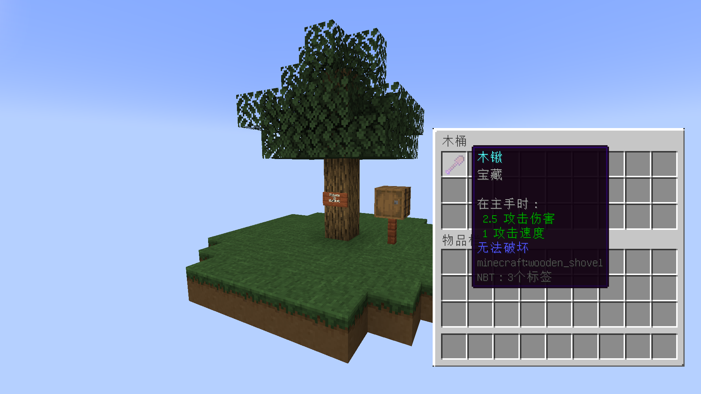

## 欢迎来到舒适空岛

**舒适空岛（Comfy Sky）**是一个能大幅度降低李芒果空岛前期吃苦程度的模组。所有添加的元素，包括修改原版中的特性都是让玩家更舒适的游玩李芒果空岛。舒适不代表作弊，更不代表这是一个懒人模组。你依旧需要按照李芒果空岛的进度进行游玩。我们重点对原版的随机机制进行了优化，使你不用重复上千次机械式操作或是等待数十个小时。我们增加了更多资源的获取方式，你可以根据自己发展需要，选择一条最适合自己的科技路线。

### 何为舒适

雷雨天气刷新需要10小时；流浪商人刷新平均需要384分钟；僵尸平均掉落铁锭几率为2.5%；炼药锅有5%的概率会在雨天积水；群系之间平均距离大约为2000格。。。。

舒适空岛对这些既肝又难又繁琐的东西做了优化，我们添加的物品都是进度的，让肉眼可以看见你每一刻的进步。获取这些物品也会让你更有成就感，因为你与这些物品的交互的每一步，都见证着你的科技发展。

### 实用工具

更多的实用工具，浮木和浮竹可以让你像搭脚手架一样在世界y轴最低点搭路；露水瓶可以让你收集露水而不用焦躁的等待雨天；打包带可以让你像浅影盒一样打包木桶；还有更多的实用工具等待你去探索。。。

### 耕地系统

作者使用了Treasure Hunt Lib 作为这个模组的前置库，它提供了一整套完整的自定义耕地解决方案。挖掘土地，种植各种各样的作物，你甚至可以去学习一下如何使用Treasure Hunt Lib来制作自己的耕地和作物。

### 完善的wiki

你可以在此查阅模组内添加的各种物品，我们为其详尽的添加了各种各样的语言描述，算法。游玩途中一定要去翻阅一下舒适空岛wiki，李芒果空岛wiki，以及我的世界wiki。

### 完善的进度系统

进度系统还处于测试阶段，适时会以数据包的形式发布

## 下载/使用

将**必要模组前置文件和本模组**一起放入游戏的mod文件夹。

然后按照李芒果空岛按照方法创建游戏存档，**需要添加李芒果空岛数据包**，**生成地形类型为skyblock**。（注：不支持李芒果金合欢数据包）

开局后如果看到下图所示的木桶中有一把有 **宝藏附魔的木铲**，即为安装成功。

如果你不慎遗失了这把木铲，你可以通过以下指令重新获得一把

/give @p minecraft:wooden_shovel

/enchant @p treasurehunt:treasure 1

### 模组前置

| 需要安装前置库 Treasure Hunt Lib 1.19-17.1.4（v17.0.6及之后版本） | [CourseForge](https://link.mcmod.cn/target/aHR0cHM6Ly93d3cuY3Vyc2Vmb3JnZS5jb20vbWluZWNyYWZ0L21jLW1vZHMvdHJlYXN1cmUtaHVudC1saWI=) |
| ------------------------------------------------------------ | ------------------------------------------------------------ |
| 需安装 Fabric API                                            | [CourseForge](https://link.mcmod.cn/target/aHR0cHM6Ly93d3cuY3Vyc2Vmb3JnZS5jb20vbWluZWNyYWZ0L21jLW1vZHMvZmFicmljLWFwaQ==) |
| 需要安装李芒果空岛 Carpet Sky Additions 1.19.2-4.1.3         | [CourseForge](https://link.mcmod.cn/target/aHR0cHM6Ly93d3cuY3Vyc2Vmb3JnZS5jb20vbWluZWNyYWZ0L21jLW1vZHMvY2FycGV0LXNreS1hZGRpdGlvbnM=) |
| 需要安装李芒果空岛前置 Carpet                                | [CourseForge](https://link.mcmod.cn/target/aHR0cHM6Ly93d3cuY3Vyc2Vmb3JnZS5jb20vbWluZWNyYWZ0L21jLW1vZHMvY2FycGV0) |

### 模组/整合包兼容性

目前尚未有不兼容报告。

推荐使用 [黑山大叔最新李芒果空岛1.19.2整合包](https://www.bilibili.com/video/BV1Sd4y11798/?spm_id_from=333.999.0.0&vd_source=3d47f7f15977e64edde817f5a2a56593) ，包含了常用的优化和辅助模组

**重要**：舒适空岛修改原版中的内容，加入非优化模组外的其他模组可能导致游戏失去平衡以及其他未知的问题

### 最新版本

|        | Forge    | Fabric        | 其他     |
| ------ | -------- | ------------- | -------- |
| 1.19.2 | 暂不支持 | 1.19.2-17.0.9 | 暂不支持 |
| 1.20   | 暂不支持 | 暂不支持      | 暂不支持 |

## 语言支持

- zh_cn 简体中文
- en_us 英语美国

### 其他展示