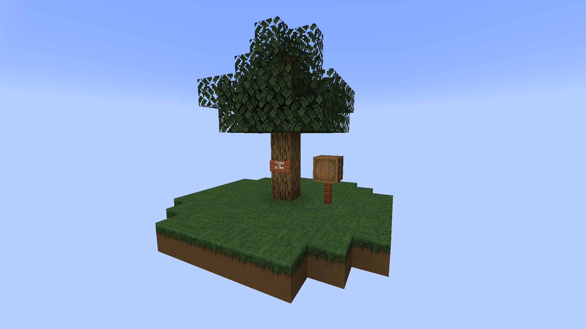

# Comfy Sky Wiki V17.0.4

## Mod Items

### Shoveled Grass Block

reason for adding this item: Ilmango skyblock has difficulties on obtaining iron ingots.

rarity: common

added since：v17.0.1

basic data: #shovel

feature: You can plant vanilla crops and flowers on it, but it doesn't support stem blocks. You can also grow dew flower which added in version v17.0.4. You have 20 percent chance to obtain  crushed coal, crushed iron ore and crushed stone separately by using any tool enchanted with ***Treasure*** .

way to obtain this item: Left click a grass block with  any tool enchanted with ***Treasure*** (enchantment.treasurehunlib.treasure)

simple explain how to use this item: This item can not acquired in survival mod.

### Crushed Minerals

#### Crushed Iron Ore

reason for adding this item: Ilmango skyblock has difficulties on obtaining iron ingots.

rarity: common

added since：v17.0.1

basic data:

feature:

way to obtain this item: Left click a grass block with  any tool enchanted with ***Treasure***. It will have 20% chance to drop a crushed iron ore.

simple explain how to use this item: You can use 9 crushed  iron ores to craft one raw iron.

#### Crushed Coal

reason for adding this item: Ilmango skyblock lacks a light source at the beginning of game.

rarity: common

added since：v17.0.1

basic data:

feature:

way to obtain this item:  Left click a grass block with  any tool enchanted with ***Treasure***. It will have 20% chance to drop a crushed  coal.

simple explain how to use this item: You can use 9 crushed coals to craft one charcoal.(For v17.0.3 and earlier version, you will get a coal instead. We changed this recipe. Because in Ilmango skyblock, you can  get a diamond  form a coal block hit by a falling anvil. It causes an unbalance.)

#### Crushed Stone

reason for adding this item: Ilmango skyblock can not melt a iron ingots without a furnace.  Unlock stone tools.

rarity: common

added since：v17.0.1

basic data: 

feature:

way to obtain this item: Left click a grass block with  any tool enchanted with ***Treasure***. It will have 20% chance to drop a crushed stone.

simple explain how to use this item: You can use 9 crushed stones to craft cobblestone.

### Dew Flower

reason for adding this item:  Ilmango skyblock is extremely difficult to get a bucket of water.

rarity: common

added since：v17.0.3

basic data: @nbt lastInteractTime   #broke instantly

feature: 

1. Sky light must higher than 0 when you collect dews form a dew flower. Ambient environment light is not unaffected. 
2. You could collect 2 dews before Dawn(time of day : 3000); You could collect 1 dew before Noon(time of day : 6000); You can't  collect any dew later than noon. (I called it evaporation.)(For v17.0.3 and earlier version, the cooldown time between collecting dews must greater than 24000 time of day) 
3. You can get an extra drop of dew on raining days.

way to obtain this item: Planting flowers on shoveled grass block. There is a pretty high chance converting flower seedling into a dew flower. You can decompose three small flowers into 8 flower seeds. The flower seeds can only survive on shoveled grass block.

simple explain how to use this item: Right click a dew flower block with a glass bottle  in a proper time to collect dews. You can only collect dews once a day on a single dew flower block. You will not get extra dews if the dew bottle is full(the dews will be consumed).

### Dew Bottle

reason for adding this item: Ilmango skyblock needs a container to collect dews.

rarity: common

added since：v17.0.3

basic data: @max damge: 50  #unbreakable

feature: When the bottle is full(Durability equal to 50), right click  a cauldron just like using a water bottle. 

way to obtain this item: Right click a dew flower with a empty glass bottle.

simple explain how to use this item:  Right click a dew flower to collect dews; Pouring a full dew bottle into a cauldron, and the water level arise by 1/3. Returning an empty glass bottle.

### Packing Tape

reason for adding this item: Ilmango skyblock needs a simple storage system to handle massive item stack drops. Encourage players to build slime farms. Easy for players to build farms.

rarity: common

added since：v17.0.4

basic data: @max damge: 5

feature:

way to obtain this item: Craft in craft table

simple explain how to use this item: Press Shift + Right click to pack a barrel. When player destroy a packed barrel block, nbt will save in that  dropped item stack.

### Packed Barrel

reason for adding this item: Ilmango skyblock needs a simple storage system to handle massive item stack  drops. Easy for players to build farms.

rarity: common

added since：v17.0.4

basic data: @nbt items  @MAX_BARREL_DISPLAY_LIST :4  #axe

feature: 1. You may put another packed barrel in a packed barrel. (Listen to me, Don't do this.)

​				2. Instead of dropping a packed barrel item stack with NBT data, it will drop a barrel item stack with NBT data when player break  a packed barrel.

way to obtain this item: Right click a barrel with a packing tape to convert a barrel block into a packed barrel block.

simple explain how to use this item: This item can not acquired in survival mod.

### Example Item

reason for adding this item:

rarity:

added since：

basic data:

feature:

way to obtain this item:

simple explain how to use this item:

## Features

### skyblock generation

Once you install this mod, it will replace original Ilmango skyblock. You new sky block should look like this.

