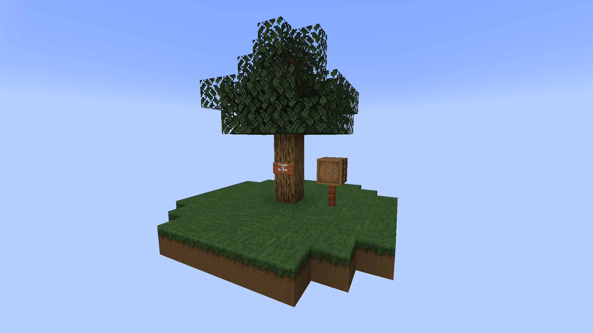

# 舒适空岛 Wiki V17.0.4

## 全物品

Example Item

reason for adding this item:

rarity:

added since：

basic data:

feature:

way to obtain this item:

simple explain how to use this item:

### 被挖掘过的草方块

添加此物品的原因：李芒果空岛前期难以获得铁锭

稀有度：普通

添加版本：v17.0.1

基础数据：#shovel

特性：可以在上面种植原版作物和花，不包括西瓜藤和南瓜藤，v17.0.4添加的露水花也可以种植在上面。使用带宝藏附魔的工具左键此方块分别有20%的概率获得碎铁矿，碎煤，碎石。

获取此物品的方法：使用带宝藏附魔（enchantment.treasurehunlib.treasure）的工具左键草方块

简单解释如何使用此物品：生存模式无法获取

### 粉碎的矿物

#### 碎铁

添加此物品的原因：李芒果空岛前期难以获取铁锭

稀有度：普通

添加版本：v17.0.1

基础数据：

特性：

获取此物品的方法：使用带宝藏附魔的工具左键草方块，有1/20的概率获得

简单解释如何使用此物品：9个碎铁可以合成一个生铁

#### 碎煤

添加此物品的原因：李芒果空岛前期缺少照明

稀有度：普通

添加版本：v17.0.1

基础数据：

特性：

获取此物品的方法：使用带宝藏附魔的工具左键草方块，有1/20的概率获得

简单解释如何使用此物品：9个碎铁可以合成一个木炭 （在v17.0.3及以前版本之前合成一个煤炭，v17.0.4版本因和李芒果空岛数据包中铁砧砸煤炭块转换为钻石冲突而修改）

#### 碎石

添加此物品的原因：李芒果空岛前期无法合成熔炉烧制铁锭，可以使用石制工具

稀有度：普通

添加版本：v17.0.1

基础数据：

特性：

获取此物品的方法：使用带宝藏附魔的工具左键草方块，有1/20的概率获得

简单解释如何使用此物品：9个碎铁可以合成一个圆石

### 露水花

添加此物品的原因：李芒果空岛前期获取水难度较大

稀有度：普通

添加版本：v17.0.3

基础数据：@nbt lastInteractTime   #broke instantly

特性：1.露水收集时，天空光需要大于0，与环境光无关

​			2.每天黎明（time of day : 3000）之前，可以采集2滴露水；每天正午（time of day : 6000）之前，可以采集1滴露水。正午之后无法获取露水。（v17.0.3及以前版本两次采集时间需要长于24000）

​			3.雨天可以额外获得一滴露水

获取此物品的方法：在被挖掘的草方块上种植花种子，有概率种出露水花

简单解释如何使用此物品：使用空瓶对着此方块右键，根据时间和天空光获得对应数量的露水。露水瓶满后右键此方块，您将不会获得额外的露水。

### 露水瓶

添加此物品的原因：李芒果空岛前期需要容器来收集露水

稀有度：普通

添加版本：v17.0.3

基础数据：@max damge: 50  #unbreakable

特性：当耐久度为50（满格耐久），右键炼药锅可以增加炼药锅1/3的水，效果等同于水瓶

获取此物品的方法：空瓶右键露水花获得

简单解释如何使用此物品：手持空瓶右键露水花采集露水；手持满格耐久的露水瓶右键炼药锅，返还空瓶，并增加炼药锅1/3的水

### 打包带

添加此物品的原因：李芒果空岛需要可以储存大量物品的容器，增加史莱姆农场的用途

稀有度：普通

添加版本：v17.0.4

基础数据：@max damge: 5

特性：

获取此物品的方法：工作台合成

简单解释如何使用此物品：Shift+右键木桶，将木桶打包，破坏木桶时，掉落物以NBT数据的形式保存在木桶掉落物中

### 打包过的木桶

添加此物品的原因：李芒果空岛需要可以储存大量物品的容器

稀有度：普通

添加版本：v17.0.4

基础数据：@nbt items  @MAX_BARREL_DISPLAY_LIST :4 #axe

特性：1.可以套娃，但是BUG，请不要这么做

​			2.破坏后掉落带NBT标签的木桶，而不是带NBT标签的打包过的木桶

获取此物品的方法：打包带右键木桶，可转换成打包过的木桶。

简单解释如何使用此物品：生存模式无法获取该物品。

### 演示物品

添加此物品的原因：

稀有度：

添加版本：

基础数据：

特性：

获取此物品的方法：

简单解释如何使用此物品：

## 特性

### 空岛生成

加载此模组会自动替换李芒果原版空岛的数据，你的空岛应该看上去像这样。

