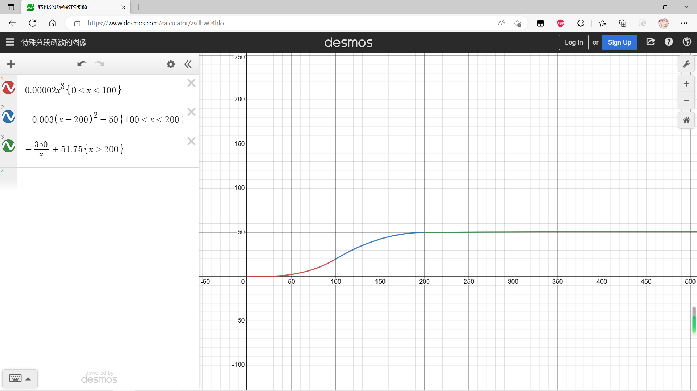
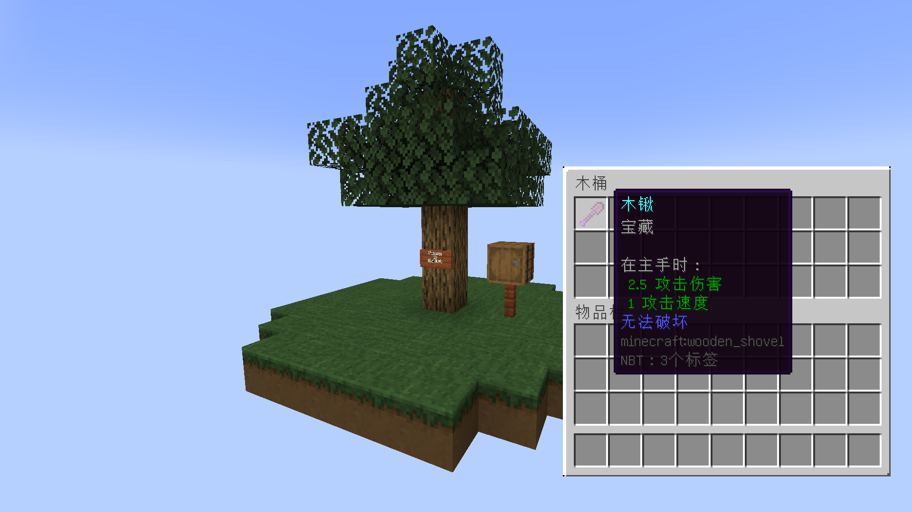
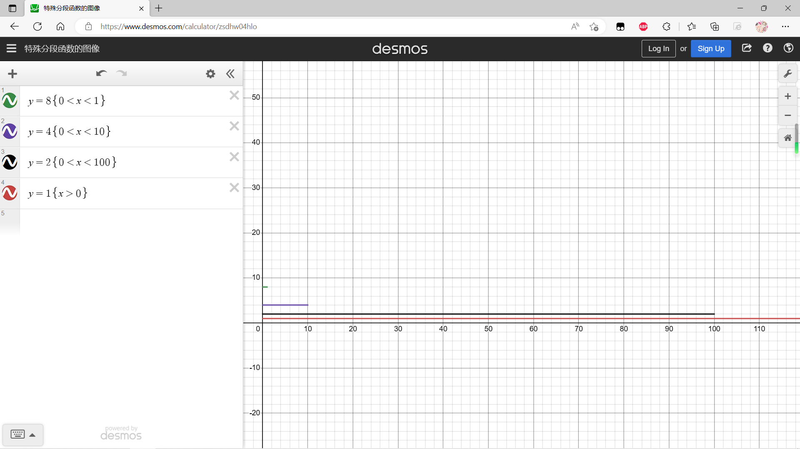

# 舒适空岛 Wiki V17.0.10*

## 全物品

### 花种子*

添加此物品的原因：模组前置

稀有度：普通

添加版本：v17.0.1

基础数据：@age:4

特性：1.当age=4时随机长出任意颜色任意品种的花朵

​			2.只能种植在挖掘过的方块上（比如挖掘过的草方块）

获取此物品的方法：工作台合成

简单解释如何使用此物品：右键放置在挖掘过的方块上

### 挖掘过的草方块

添加此物品的原因：李芒果空岛前期难以获得铁锭

稀有度：普通

添加版本：v17.0.1

基础数据：#shovel

特性：1.可以在上面种植原版作物和花，不包括西瓜藤和南瓜藤，v17.0.4添加的露水花也可以种植在上面。		   2.使用带宝藏附魔的工具左键此方块分别有1/20的概率获得碎铁矿，碎煤，碎石。

获取此物品的方法：使用带宝藏附魔（enchantment.treasurehunlib.treasure）的工具左键草方块

简单解释如何使用此物品：生存模式无法获取

### 挖掘过的红沙

添加此物品的原因：拓展金锭的获取方法，鼓励玩家前往暖水海洋

稀有度：普通

添加版本：v17.0.6

基础数据：#shovel

特性：1.不能在上面种植植物

​			2.使用带宝藏附魔的工具左键此方块分别有1/20的概率获得碎金矿

获取此物品的方法：使用带宝藏附魔（enchantment.treasurehunlib.treasure）的工具左键红沙

简单解释如何使用此物品：生存模式无法获取

### 粉碎的矿物

#### 碎铁

添加此物品的原因：李芒果空岛前期难以获取铁锭

稀有度：普通

添加版本：v17.0.1

基础数据：

特性：

获取此物品的方法：使用带宝藏附魔的工具左键草方块，有1/20的概率获得

简单解释如何使用此物品：9个碎铁矿可以合成一个粗铁

#### 碎煤

添加此物品的原因：李芒果空岛前期缺少照明

稀有度：普通

添加版本：v17.0.1

基础数据：

特性：

获取此物品的方法：使用带宝藏附魔的工具左键草方块，有1/20的概率获得

简单解释如何使用此物品：9个碎铁可以合成一个木炭 （在v17.0.3及以前版本之前合成一个煤炭，v17.0.4版本因和李芒果空岛数据包中铁砧砸煤炭块转换为钻石冲突而修改）

#### 碎石

添加此物品的原因：李芒果空岛前期无法合成熔炉烧制铁锭，可以使用石制工具

稀有度：普通

添加版本：v17.0.1

基础数据：

特性：

获取此物品的方法：使用带宝藏附魔的工具左键草方块，有1/20的概率获得

简单解释如何使用此物品：9个碎铁可以合成一个圆石

#### 碎金矿

添加此物品的原因：拓展金锭的获取方法，鼓励玩家前往暖水海洋

稀有度：普通

添加版本：v17.0.6

基础数据：

特性：

获取此物品的方法：使用带宝藏附魔的工具左键红沙，有1/20的概率获得

简单解释如何使用此物品：9个碎金矿可以合成一个粗金

### 露水花*

添加此物品的原因：李芒果空岛前期获取水难度较大

稀有度：普通

添加版本：v17.0.3

基础数据：@nbt lastInteractTime   #broke instantly

特性：1.露水收集时，天空光需要大于0，与环境光无关

​			2.每天黎明（time of day : 3000）之前，可以采集2滴露水；每天正午（time of day : 6000）之前，可以采集1滴露水。正午之后无法获取露水。

​			3.雨天可以额外获得一滴露水

​			4.露水花可以制作谜之炖菜，食用后产生速度效果，时长4秒

​			5.可以放置在花盆中

获取此物品的方法：在被挖掘的草方块上种植花种子，有概率种出露水花

简单解释如何使用此物品：使用空瓶对着此方块右键，根据时间和天空光获得对应数量的露水。露水瓶满后右键此方块，您将不会获得额外的露水。

### 露水瓶

添加此物品的原因：李芒果空岛前期需要容器来收集露水

稀有度：普通

添加版本：v17.0.3

基础数据：@max damge: 50  #unbreakable

特性：当耐久度为50（满格耐久），右键炼药锅可以增加炼药锅1/3的水，效果等同于水瓶

获取此物品的方法：空瓶右键露水花获得

简单解释如何使用此物品：手持空瓶右键露水花采集露水；手持满格耐久的露水瓶右键炼药锅，返还空瓶，并增加炼药锅1/3的水

### 打包带

添加此物品的原因：李芒果空岛需要可以储存大量物品的容器，增加史莱姆农场的用途

稀有度：普通

添加版本：v17.0.4

基础数据：@max damge: 5

特性：

获取此物品的方法：工作台合成

简单解释如何使用此物品：Shift+右键木桶，将木桶打包，破坏木桶时，掉落物以NBT数据的形式保存在木桶掉落物中

### 打包过的木桶

添加此物品的原因：李芒果空岛需要可以储存大量物品的容器

稀有度：普通

添加版本：v17.0.4

基础数据：#barrel_packing_blacklist @nbt items  @MAX_BARREL_DISPLAY_LIST :4 #axe

特性： 1.破坏后掉落带NBT标签的木桶，而不是带NBT标签的打包过的木桶

​			2.打包时，木桶物品列表中有木桶或浅影盒，打包会失败

获取此物品的方法：打包带Shift + 右键木桶，可转换成打包过的木桶。

简单解释如何使用此物品：生存模式无法获取该物品。

### 漂浮物

#### 浮木

添加此物品的原因：Minecraft群系之间距离非常远，空岛搭方块非常不便

稀有度：普通

添加版本：v17.0.6

基础数据：@MAX_DRIFTWOOD_RADIUS: 5 #can place on water  #axe

特性：1.可以放置在水源方块上，就像睡莲那样

​		   2.可以放置在世界维度的y轴最低点，比如主世界（Y 最低值 = -64），末地&&地狱（Y 最低值 = 0）

​		   3.当生物踩在浮上会改变浮木漂浮的状态，但是碰撞箱不会改变

​		   4.手持浮木放置时半径最大为5

​		   5.可以向水平8个方向放置

​		   6.遇到障碍物它会自动停下来

获取此物品的方法：工作台合成

简单解释如何使用此物品：右键放置在水源方块上（包括含水方块）；手持浮木右键一个浮木方块上表面时，会朝玩家视线（水平8个方向）放置一个浮木，就像搭建横向的脚手架一样

#### 浮竹

添加此物品的原因：Minecraft群系之间距离非常远，空岛搭方块非常不便，拓展竹子的用法，鼓励玩家前往丛林群系

稀有度：普通

添加版本：v17.0.7

基础数据：@MAX_DRIFTWOOD_RADIUS: 5 #can place on water  #axe

特性：和浮木的特性一样

获取此物品的方法：工作台合成

简单解释如何使用此物品：右键放置在水源方块上（包括含水方块）；手持浮竹右键一个浮竹方块上表面时，会朝玩家视线（水平8个方向）放置一个浮竹，就像搭建横向的脚手架一样

### 静电释放器*

添加此物品的原因：Minecraft雷击平均时间约为10小时，而且雷电不能被存储，减少实体卡顿

稀有度：普通

添加版本：v17.0.8

基础数据：@MAX_ESD_CAPACITY = 9999.0 #nbt capacity #pickaxe #need_stone_tool

(图) [x轴-实体数量；y轴-每200gt产生静电摩擦]

特性：1.产生静电摩擦与方块中心 3x1x3 体积内实体数量有关，这边的实体特指生物实体

​			2.雨天不会产生静电摩擦

​			3.超过200实体，静电摩擦产量无限接近51.75/200gt

​			4.当静电摩擦存储满（capacity >= 9999.0)，且方块光等于15时，方块上方产生一道雷电

​			5.方块掉落时，nbt无法转移到物品上

​			6.使用比较器可以检测当前的容量

​			7.按200实体计算，收集满大约需要33.3分钟。按100实体计算，收集大约需要83.3分钟

获取此物品的方法：工作台合成

简单解释如何使用此物品：右键放置，放置在生物周围可收集静电摩擦（具体计算看上图）

### 铜调试棒*

添加此物品的原因：创造模式调试工具

稀有度：史诗

添加版本：v17.0.10

基础数据：@TIME_OF_A_DAY:1440

特性：1.右键静电释放器计算以当前产生静电的速率至存储满所花费的时间

获取此物品的方法：创造物品栏

简单解释如何使用此物品：生存模式无法获取

### 演示物品

添加此物品的原因：

稀有度：

添加版本：

基础数据：

特性：

获取此物品的方法：

简单解释如何使用此物品：

## 特性

### 空岛生成

加载此模组会自动替换李芒果原版空岛的数据，你的空岛应该看上去像这样。

添加版本：v17.0.3

### 流浪商人生成*

加载此模组会自动替换Minecraft流浪商人生成算法。

添加版本：v17.0.9

（图：x轴-1000以内的随机数， y轴-生成流浪商人的数量）

原版流浪商人每24000tick有25%，50%，75% * 10%生成几率（即最大生成可能性为7.5%每24000tick）

修改过后的流浪商人生成概率

| 等级 | 概率               | 最大生成概率 | 生成流浪商人数量（每24000tick） |
| ---- | ------------------ | ------------ | ------------------------------- |
| 0    | 25%,50%,75%        | 不适用       | 0                               |
| 1    | 25%,50%,75% * 100% | 75%          | 1                               |
| 2    | 25%,50%,75% * 10%  | 7.5%         | 2                               |
| 3    | 25%,50%,75% * 1%   | 0.75%        | 4                               |
| 4    | 25%,50%,75% * 0.1% | 0.075%       | 8                               |

使用指令 /gamerule doTraderSpawning false 来关闭流浪商人的生成（默认为true）

