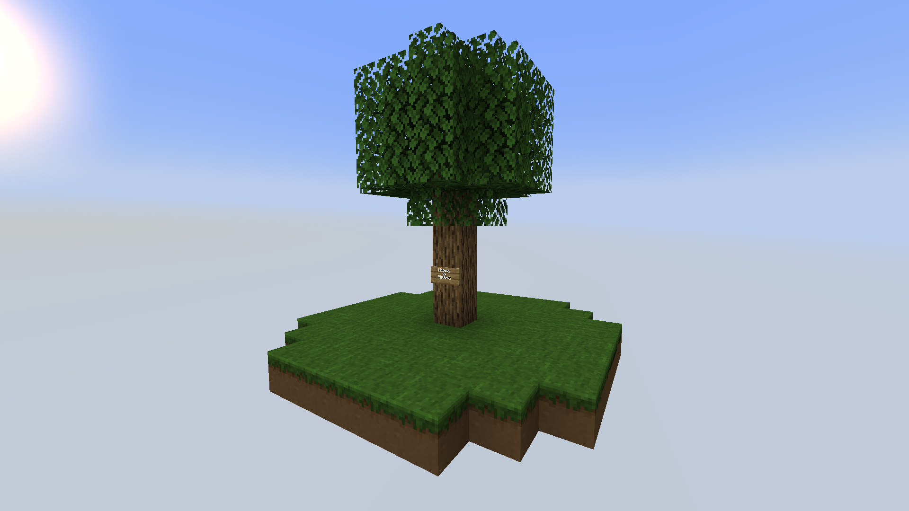

# 舒适空岛 Wiki V17.0.15*

## 全物品

### 挖掘过的方块*

#### 挖掘过的草方块

添加此物品的原因：李芒果空岛前期难以获得铁锭

稀有度：普通

添加版本：v17.0.1

基础数据：@LOOT：shoveled_blocks/shoveled_grass_block  #shovel #treasurehuntlib:farmland

特性：1.具有耕地标签，可以在上面种植作物

​		   2.使用任意等级的**挖掘铲**挖掘草方块分别有1/20的概率获得碎铁矿，碎煤，碎石

获取此物品的方法：使用任意等级的**挖掘铲**挖掘草方块

简单解释如何使用此物品：生存模式无法获取

#### 挖掘过的红沙

添加此物品的原因：拓展金锭的获取方法，鼓励玩家前往暖水海洋

稀有度：普通

添加版本：v17.0.6

基础数据：@LOOT：shoveled_blocks/shoveled_red_sand #shovel

特性：1.不能在上面种植植物

​			2.使用任意等级的**挖掘铲**挖掘红沙分别有1/20的概率获得碎金矿和碎沙

获取此物品的方法：使用任意等级的**挖掘铲**挖掘红沙

简单解释如何使用此物品：生存模式无法获取

#### 挖掘过的沙子*

添加此物品的原因：拓展铜锭的获取方法，鼓励玩家前往暖水海洋

稀有度：普通

添加版本：v17.0.13

基础数据：@LOOT：shoveled_blocks/shoveled_sand #shovel

特性：1.不能在上面种植植物

​			2.使用任意等级的**挖掘铲**挖掘红沙分别有1/20的概率获得碎铜矿和碎沙

获取此物品的方法：使用任意等级的**挖掘铲**挖掘沙子

简单解释如何使用此物品：生存模式无法获取

#### 挖掘过的泥巴*

添加此物品的原因：拓展粘土的获取方法

稀有度：普通

添加版本：v17.0.15

基础数据：@MAX_MOISTURE:7 @LOOT：shoveled_blocks/shoveled_mud #shovel #treasurehuntlib:farmland

特性：1.具有耕地标签，可以在上面种植作物

​			2.使用任意等级的**挖掘铲**挖掘草方块分别有1/20的概率获得粘土球，木棍

​			3.默认方块状态的湿度为7

​			4.当该方块下方2格处有滴水石锥时湿润会逐渐减少

获取此物品的方法：使用任意等级的**挖掘铲**挖掘泥巴

简单解释如何使用此物品：生存模式无法获取

#### 挖掘过的雪块*

添加此物品的原因：Minecraft中杀手兔只能通过指令生成

稀有度：普通

添加版本：v17.0.15

基础数据：@LOOT：shoveled_blocks/shoveled_snow_block #shovel 

特性：1.不能在上面种植植物

​			2.使用任意等级的**挖掘铲**挖掘红沙分别有1/20的概率获得碎石，1/4的概率获得雪球，同时有1/64的概率生成一只杀手兔

获取此物品的方法：使用任意等级的**挖掘铲**挖掘雪块

简单解释如何使用此物品：生存模式无法获取

### 粉碎的矿物

#### 碎铁矿

添加此物品的原因：李芒果空岛前期难以获取铁锭

稀有度：普通

添加版本：v17.0.1

基础数据：

特性：

获取此物品的方法：使用任意等级的**挖掘铲**左键挖掘草方块，有1/20的概率获得

简单解释如何使用此物品：9个碎铁矿可以合成一个粗铁

#### 碎煤

添加此物品的原因：李芒果空岛前期缺少照明

稀有度：普通

添加版本：v17.0.1

基础数据：

特性：

获取此物品的方法：使用任意等级的**挖掘铲**左键挖掘草方块，有1/20的概率获得

简单解释如何使用此物品：9个碎铁可以合成一个木炭 （在v17.0.3及以前版本之前合成一个煤炭，v17.0.4版本因和李芒果空岛数据包中铁砧砸煤炭块转换为钻石冲突而修改）

#### 碎石

添加此物品的原因：李芒果空岛前期无法合成熔炉烧制铁锭，可以使用石制工具

稀有度：普通

添加版本：v17.0.1

基础数据：

特性：

获取此物品的方法：使用任意等级的**挖掘铲**左键挖掘草方块或雪块，有1/20的概率获得	

简单解释如何使用此物品：9个碎铁可以合成一个圆石

#### 碎金矿

添加此物品的原因：拓展金锭的获取方法，鼓励玩家前往暖水海洋

稀有度：普通

添加版本：v17.0.6

基础数据：

特性：

获取此物品的方法：使用任意等级的**挖掘铲**左键挖掘红沙，有1/20的概率获得

简单解释如何使用此物品：9个碎金矿可以合成一个粗金

#### 碎铜矿*

添加此物品的原因：拓展铜锭的获取方法

稀有度：普通

添加版本：v17.0.12

基础数据：

特性：

获取此物品的方法：使用任意等级的**挖掘铲**左键挖掘沙子，有1/20的概率获得

简单解释如何使用此物品：9个碎铜矿可以合成一个粗铜

#### 碎沙*

添加此物品的原因：拓展沙子的获取方法（Minecraft 1.19.2）

​								~~拓展可疑的沙子的获取方法（Minecraft 1.20）~~

稀有度：普通

添加版本：v17.0.12

基础数据：

特性：

获取此物品的方法：使用任意等级的**挖掘铲**左键挖掘红沙或沙子，有1/20的概率获得

简单解释如何使用此物品：9个碎沙可以合成一个沙子（Minecraft 1.19.2）

### 种子

#### 花种子*

添加此物品的原因：模组前置

稀有度：普通

添加版本：v17.0.1

基础数据：@age:4

特性：1.当age=4时随机长出任意颜色任意品种的花朵

​			2.只能种植在挖掘过的方块上（比如挖掘过的草方块）

获取此物品的方法：工作台合成

简单解释如何使用此物品：右键放置在挖掘过的方块上

### 功能花

#### 露水花*

添加此物品的原因：李芒果空岛前期获取水难度较大

稀有度：普通

添加版本：v17.0.3

基础数据：@nbt lastInteractTime   #broke instantly

特性：1.露水收集时，天空光需要大于0，与环境光无关

​			2.每天黎明（time of day : 3000）之前，可以采集2滴露水；每天正午（time of day : 6000）之前，可以采集1滴露水。正午之后无法获取露水。

​			3.雨天可以额外获得一滴露水

​			4.露水花可以制作谜之炖菜，食用后产生速度效果，时长4秒

​			5.可以放置在花盆中

开发者注释：你没有看错，这个贴图来自于biomes-o-plenty，有趣的是在biomes-o-plenty中这种植物叫做荧光花，但是在舒适空岛中它是唯一一个不会发光的功能花

获取此物品的方法：在被挖掘的方块上种植花种子，有概率种出露水花

简单解释如何使用此物品：使用空瓶对着此方块右键，根据时间和天空光获得对应数量的露水。露水瓶满后右键此方块，您将不会获得额外的露水。

#### 火焰花*

添加此物品的原因：Minecraft中没有可以发光的花

稀有度：普通

添加版本：v17.0.11

基础数据：@light level:12  #broke instantly

特性：1.可以发出12格光照强度

​			2.火焰花可以制作谜之炖菜，食用后产生发光效果，时长4秒

​			3.可以放置在花盆中，同时火焰花盆栽可以发出12格光照强度

获取此物品的方法：在被挖掘的方块上种植花种子，有概率种出火焰花

简单解释如何使用此物品：右键放置在标签为minecraft:dirt或标签为treasurehuntlib:farmland的方块上

#### 生命花*

添加此物品的原因：Minecraft中花朵不可繁殖，原版农业缺乏趣味性

稀有度：普通

添加版本：v17.0.13

基础数据：@light level:12  #broke instantly #small _flowers

特性：1.可以发出12格光照强度

​		   2.生命花可以制作谜之炖菜，食用后产生生命恢复效果，时长4秒

​		   3.当种植在鲜活草地上时，可以模拟出康威生命游戏，详见特性-康威生命游戏

​			4.方块位置没有X和Z轴的偏移

​			5.可以放置在花盆中，同时生命花盆栽可以发出12格光照强度

获取此物品的方法：使用骨粉右键鲜活草地 或 生命花无限繁殖

简单解释如何使用此物品：右键放置在标签为minecraft:dirt或标签为treasurehuntlib:farmland的方块上；放置在鲜活草地以触发特殊计算，详见特性-康威生命游戏

### 实用工具*

#### 露水瓶

添加此物品的原因：李芒果空岛前期需要容器来收集露水

稀有度：普通

添加版本：v17.0.3

基础数据：@max damge: 50  #unbreakable

特性：当耐久度为50（满格耐久），右键炼药锅可以增加炼药锅1/3的水，效果等同于水瓶

获取此物品的方法：空瓶右键露水花获得

简单解释如何使用此物品：手持空瓶右键露水花采集露水；手持满格耐久的露水瓶右键炼药锅，返还空瓶，并增加炼药锅1/3的水

#### 打包带

添加此物品的原因：李芒果空岛需要可以储存大量物品的容器，增加史莱姆农场的用途

稀有度：普通

添加版本：v17.0.4

基础数据：@max damge: 5

特性：

获取此物品的方法：工作台合成

简单解释如何使用此物品：Shift+右键木桶，将木桶打包，破坏木桶时，掉落物以NBT数据的形式保存在木桶掉落物中

#### 打包过的木桶

添加此物品的原因：李芒果空岛需要可以储存大量物品的容器

稀有度：普通

添加版本：v17.0.4

基础数据：#barrel_packing_blacklist @nbt items  @MAX_BARREL_DISPLAY_LIST :4 #axe

特性： 1.破坏后掉落带NBT标签的木桶，而不是带NBT标签的打包过的木桶

​			2.打包时，木桶物品列表中有木桶或浅影盒，打包会失败

获取此物品的方法：打包带Shift + 右键木桶，可转换成打包过的木桶。

简单解释如何使用此物品：生存模式无法获取该物品。

#### 浮木

添加此物品的原因：Minecraft群系之间距离非常远，空岛搭方块非常不便

稀有度：普通

添加版本：v17.0.6

基础数据：@MAX_DRIFTWOOD_RADIUS: 5 #can place on water  #axe

特性：1.可以放置在水源方块上，就像睡莲那样

​		   2.可以放置在世界维度的y轴最低点，比如主世界（Y 最低值 = -64），末地&&地狱（Y 最低值 = 0）

​		   3.当生物踩在浮木上会改变浮木漂浮的状态，但是碰撞箱不会改变

​		   4.手持浮木放置时半径最大为5

​		   5.可以向水平8个方向放置

​		   6.遇到障碍物它会自动停下来

开发者注释：作者曾多次想删除这个方块，因为放置过多会产生摩尔纹

获取此物品的方法：工作台合成

简单解释如何使用此物品：右键放置在水源方块上（包括含水方块）；手持浮木右键一个浮木方块上表面时，会朝玩家视线（水平8个方向）放置一个浮木，就像搭建横向的脚手架一样

#### 浮竹

添加此物品的原因：Minecraft群系之间距离非常远，空岛搭方块非常不便，拓展竹子的用法，鼓励玩家前往丛林群系

稀有度：普通

添加版本：v17.0.7

基础数据：@MAX_DRIFTWOOD_RADIUS: 5 #can place on water  #axe

特性：和浮木的特性一样

获取此物品的方法：工作台合成

简单解释如何使用此物品：右键放置在水源方块上（包括含水方块）；手持浮竹右键一个浮竹方块上表面时，会朝玩家视线（水平8个方向）放置一个浮竹，就像搭建横向的脚手架一样

#### 静电释放器*

添加此物品的原因：Minecraft雷击平均时间约为10小时，而且雷电不能被存储，减少实体卡顿

稀有度：普通

添加版本：v17.0.8

基础数据：@MAX_ESD_CAPACITY = 9999.0 #nbt capacity #pickaxe #need_stone_tool

(图) [x轴-实体数量；y轴-每200gt产生静电摩擦]

特性：1.产生静电摩擦与方块中心 3x1x3 体积内实体数量有关，这边的实体特指生物实体

​			2.雨天不会产生静电摩擦

​			3.超过200实体，静电摩擦产量无限接近51.75/200gt

​			4.当静电摩擦存储满（capacity >= 9999.0)，且天空光等于15时，方块上方产生一道雷电

​			5.方块掉落时，nbt无法转移到物品上

​			6.使用比较器可以检测当前的容量

​			7.按200实体计算，收集满大约需要33.3分钟。按100实体计算，收集大约需要83.3分钟

获取此物品的方法：工作台合成

简单解释如何使用此物品：右键放置，放置在生物周围可收集静电摩擦（具体计算看上图）

#### 挂历*

添加此物品的原因：Minecraft不使用指令无法得知当前生存的天数

稀有度：普通

添加版本：v17.0.12

基础数据：@nbt Day @nbt Text1-4 @nbt glow @nbt dye #axe @waterlogable @max count:1

特性：1.含水方块

​			2.可以使用染料或是荧光墨囊改变文字的颜色，就像告示牌一样

开发者注释：这个方块是致敬了Raft中的日历，显示内容和Raft中的日历完全一致

获取此物品的方法：工作台合成

简单解释如何使用此物品：右键放置在方块的侧面，会自动刷新当前的生存天数。由于这个方块和告示牌一样通过实体渲染，放置过多可能会导致严重卡顿

#### 捕鱼陷阱*

添加此物品的原因：Minecraft中没有自动钓鱼，玩家物品掉入虚空后将会被删除，鼓励玩家前往针叶林群系

稀有度：普通

添加版本：v17.0.13

基础数据：#nbt owner #nbt lastInteractTime #nbt Items #axe @luck :0 

特性：1.可以放置在水源方块上

​			2.当放置在水源方块上时，每隔640tick(32秒)会自动捕获#LOOTS: fishing, 幸运值为0

​			3.当放置在世界Y轴最低值时，每隔每隔640tick(32秒)会尝试捕获玩家掉落于虚空且稀有度等级高于普通且不在带有#lost_property_blacklist的物品。用投掷器发射的物品不会记录成玩家掉落

​			4.当捕获物品时，物品会显示在捕鱼陷阱上方

​			5.使用fill command放置的捕鱼陷阱玩家uuid是随机生成的

​			6.玩家掉落虚空的物品的计量单位为物品组，若两次投下相同的物品，则占用2个物品组

​			7.一个玩家默认拥有27个遗失物品栏

​			8.当遗失物品栏装满时，会默认覆盖下标为0的物品组

开发者注释：遗失物品栏不仅仅防止玩家因为手滑不小心把物品丢入虚空。同时它又是一个容器，和末影箱存储类似的原理，玩家可以隔空取物。捕鱼陷阱是作者第一个想加入的方块，但却是在13个版本后才正式加入，光是这一个方块的加入，就为舒适空岛注入了558行代码。

获取此物品的方法：工作台合成

简单解释如何使用此物品：右键放置在水源方块上（包括含水方块）；当捕获物品时，右键捕鱼陷阱可获取捕获的物品

#### 生长素*

添加此物品的原因：增加获取鲜活草地的获得方式，鼓励玩家前往远古城市

稀有度：稀有

添加版本：v17.0.14

基础数据：#max count:16

特性：1.玩家使用后将有10tick的冷却时间

​			开发者注释：生长素（auxin）是舒适空岛里拼写单词最短的物品

开发者注释：在生长素加入前，获取鲜活草地是通过幽匿体和草方块合成而来

获取此物品的方法：使用非精准采集的工具破坏幽匿催发体100%获得1个生长素

简单解释如何使用此物品：右键带#zoetic_grass_can_spread tag的方块，将这些方块转化成鲜活草地

### 挖掘铲

#### 求生者挖掘铲*

添加此物品的原因：模组前置

稀有度：普通

添加版本：v17.0.11

基础数据：RANGE=1 #digging_shovel @Material.WOOD

特性：1.可以挖掘1x1的土地

​			2.挖掘等级为木质

获取此物品的方法：工作台合成

简单解释如何使用此物品：左键挖掘方块，详见特性-挖掘铲可挖掘的方块

#### 水铲*

添加此物品的原因：模组前置

稀有度：普通

添加版本：v17.0.11

基础数据：RANGE=2 #digging_shovel @Material.STONE

特性：1.可以挖掘2x2的土地

​			2.挖掘等级为石质

​			3.挖掘过的土地带有moisture属性时，挖掘过的方块的moisture值设置为最大值

获取此物品的方法：工作台合成

简单解释如何使用此物品：左键挖掘方块，详见特性-挖掘铲可挖掘的方块。如果这个方块带有moisture的属性，挖掘过的方块的moisture值设置为最大值

#### 工程师挖掘铲*

添加此物品的原因：模组前置

稀有度：普通

添加版本：v17.0.12

基础数据：RANGE=3 #digging_shovel @Material.IRON

特性：1.可以挖掘3x3的土地

​			2.挖掘等级为铁质

获取此物品的方法：工作台合成

简单解释如何使用此物品：左键挖掘方块，详见特性-挖掘铲可挖掘的方块

#### 皇家挖掘铲*

添加此物品的原因：模组前置

稀有度：稀有

添加版本：v17.0.12

基础数据：RANGE=4 #digging_shovel @Material.DIAMOND

特性：1.可以挖掘4x4的土地

​			2.挖掘等级为钻石

获取此物品的方法：工作台合成

简单解释如何使用此物品：左键挖掘方块，详见特性-挖掘铲可挖掘的方块

#### 大师铲*

添加此物品的原因：模组前置

稀有度：史诗

添加版本：v17.0.12

基础数据：RANGE=5 #digging_shovel @Material.NETHERITE

特性：1.可以挖掘5x5的土地

​			2.挖掘等级为下届合金

获取此物品的方法：工作台合成

简单解释如何使用此物品：左键挖掘方块，详见特性-挖掘铲可挖掘的方块

### 创造模式物品

#### 铜调试棒*

添加此物品的原因：创造模式调试工具

稀有度：史诗

添加版本：v17.0.10

基础数据：

特性：1.右键静电释放器计算以当前产生静电的速率至存储满所花费的时间

​			2.右键捕鱼陷阱以查看玩家遗失物品列表

​			3.右键露水花以查看当前时间可以获取露水的量

获取此物品的方法：创造物品栏

简单解释如何使用此物品：生存模式无法获取，如果右键方块无效可以尝试shift+右键

#### 金唱片*

添加此物品的原因：创造模式测试物品

稀有度：史诗

添加版本：v17.0.13

基础数据：#max count:1

特性：待定（和红石有关）

获取此物品的方法：创造物品栏

简单解释如何使用此物品：生存模式无法获取

### 鲜活草地*

添加此物品的原因：Minecraft中花朵不可繁殖，原版农业缺乏趣味性

稀有度：普通

添加版本：v17.0.13

基础数据：#shovel #dirt @TINT INDEX：0x369E1D

特性：1.每隔10tick(1秒)尝试进行一次康威生命游戏判断

​			2.当time of day：12000 至次日 time of day ：0， 康威生命游戏判断停止

​			3.会传播带#zoetic_grass_can_spread tag的方块，就像草方块一样

​			4.是方块实体，不能被活塞推动

获取此物品的方法：手持生长素右键标签为#zoetic_grass_can_spread tag的方块 或 使用精准采集的工具

简单解释如何使用此物品：右键放置

### 演示物品

添加此物品的原因：

稀有度：

添加版本：

基础数据：

特性：

获取此物品的方法：

简单解释如何使用此物品：

## 特性

### 挖掘铲可挖掘的方块*

| 可挖掘方块 | id                    | 挖掘等级      | 添加版本 | 掉落物                                                       | 绑定方块                               |
| ---------- | --------------------- | ------------- | -------- | ------------------------------------------------------------ | -------------------------------------- |
| 雪块       | minecraft:snow_block  | Material.WOOD | v17.0.15 |     |   |
| 泥巴       | minecraft:mud         | Material.WOOD | v17.0.15 |            |          |
| 沙子       | minecraft:sand        | Material.WOOD | v17.0.13 |  |         |
| 红沙       | minecraft:red_sand    | Material.WOOD | v17.0.6  |  |     |
| 草方块     | minecraft:grass_block | Material.WOOD | v17.0.1  |  |  |
|            |                       |               |          |                                                              |                                        |

### 康威生命游戏*

添加版本：v17.0.13

鲜活草地每20tick进行一次判断是否需要长出生命花或是上方生命花死亡

在舒适空岛中的设定是time of day 大于 12000时，玩家可以自由编辑生命花的组合形状

可以把生命花种植在鲜活草地上来模拟康威生命游戏

[康威生命游戏 - 维基百科，自由的百科全书 (wikipedia.org)](https://zh.wikipedia.org/wiki/康威生命游戏)

### ~~空岛生成~~（已移除）*

~~加载此模组会自动替换李芒果原版空岛的数据，你的空岛应该看上去像这样。~~

~~添加版本：v17.0.3~~

v17.0.11版本更新后，不再替换李芒果初始空岛，你现在可以选择添加金合欢数据包

### 流浪商人生成*

加载此模组会自动替换Minecraft流浪商人生成算法。

添加版本：v17.0.9

（图：x轴-1000以内的随机数， y轴-生成流浪商人的数量）

原版流浪商人每24000tick有25%，50%，75% * 10%生成几率（即最大生成可能性为7.5%每24000tick）

修改过后的流浪商人生成概率

| 等级 | 概率               | 最大生成概率 | 生成流浪商人数量（每24000tick） |
| ---- | ------------------ | ------------ | ------------------------------- |
| 0    | 25%,50%,75%        | 不适用       | 0                               |
| 1    | 25%,50%,75% * 100% | 75%          | 1                               |
| 2    | 25%,50%,75% * 10%  | 7.5%         | 2                               |
| 3    | 25%,50%,75% * 1%   | 0.75%        | 4                               |
| 4    | 25%,50%,75% * 0.1% | 0.075%       | 8                               |

使用指令 /gamerule doTraderSpawning false 来关闭流浪商人的生成（默认为true）

### 前置库TreasureHuntLib*

添加版本：v17.0.1

| 舒适空岛版本                  | TreasureHuntLib版本 |
| ----------------------------- | ------------------- |
| 1.19.2-17.0.1~1.19.2-17.0.5   | 不详                |
| 1.19.2-17.0.6~1.19.2-17.0.7   | 1.19.2-17.1.4       |
| 1.19.2-17.0.8~1.19.2-17.0.10  | 1.19.2-17.1.5       |
| 1.19.2-17.0.11                | 1.19.2-17.1.6       |
| 1.19.2-17.0.12~1.19.2-17.0.14 | 1.19.2-17.1.7       |
| 1.19.2-17.0.15~               | 1.19.2-17.2.1       |

